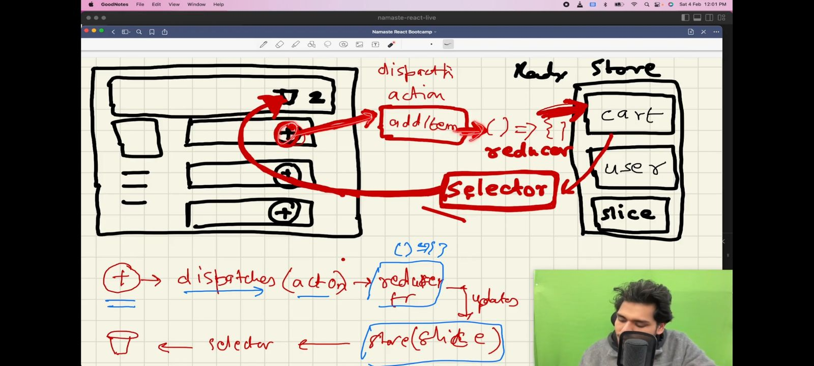

 
# Namaste React
 
## Parcel

 * Parcel is bundler. 
 * HMR = Hot Module Replacement(currently using parcel)
 * File watcher algorithms - written in c++
 * Buindling
 * Minify
 * Clearning our code
 * Super fast build algorithms
 * Image optimization
 * Caching while development
 * Consistent hashing algorithms
 * Compression
 * Compatible with older version of browser
 * HTTPS on dev
 * Zero config
 * Tree shaking - Removing unwanted code
 * Transitive dependencies -> dependencies over another dependencies
  **References**
    * [Parcel](https: //parceljs.org/docs/).
    * [BrowserList](https://browserslist.dev/).

## Basics of React

* React element is an object.
* `CreateElement` => it gives an object and converted in HTML code & puts it upon `dom`.
* `JSX (javaScript xml)` => it is an expression.
* JSX is not HTML, it have HTML like structure or syntax.
* `Functional componenet` is nothing but a javaScript function that reaturn `JSX`;
* Any component name starts with capital latter in react. (it is convention to use not mandatory).
* In render or returen method
    ```javaScript
        render(){
          <div>
          {write javaScrpt hare}
          </div>
        }

        return(
          <>
          {JavaScript hare}
          </>
        )
    ```
* If api return mallisious code, jsx senitizes it.
* `JSX` is very secure.
* `Component composition` => if you use component inside component called composing component.
* `JSX` wont work without babel. because under the hood JSX converted into createElement, createElement gives an object, that object converted into HTML and added to the dom.
* JSX only have one parent element.
* In react `.jsx` extension also acceptable.
**NOTE**
* If export is default there is no need to import with the same name
    ```javaScript
      export default Header;

      import newHeader from '..'
    ```
* You want your variable every time synced with the UI you need to use your state variable 
* React has one way data binding.

## Required basic structure of `food villa`
 
  * Header
    * Logo
    * Nav Items(Right side)
    * Cart
  * Body
    * Search Bar
    * RestaurantList
      * RestaurantCard
      * Image
      * Name
      * Rating
      * Cusines
  * Footer
    * Links
    * Copyrights 

## Fragment

```javaScript
  <React.Fragment>
    <Header />
    <Outlet />
    <Footer />
    </React.Fragment>
```
## Snippets
   
  ```javaScript 
   <RestaurantCard {...restaurantList[0].data}/>
      < RestaurantCard {...
        restaurantList[1].data
      }
      />
      < RestaurantCard {...
        restaurantList[2].data
      }
      />
      < RestaurantCard {...
        restaurantList[3].data
      }
      />
      < RestaurantCard {...
        restaurantList[4].data
      }
      /> 
  ```

## Reconsiliation 

* Reconsiliation =>  React uses a diff algorithm to find out the different between trees
* diff algorithm find out the what's needs to be updated
* virtualDOM is representation of actual dom
* React Fiber =>  it's a new Reconsiliation engine, it came to react 16.
**References**
  * [Virtual DOM and Internals](https://legacy.reactjs.org/docs/faq-internals.html).
  * [Reconciliation](https://legacy.reactjs.org/docs/reconciliation.html).
  * [React Fiber Architecture](https://github.com/acdlite/react-fiber-architecture).
  * [React: What is Fiber Architecture and How Does it Work?](https://blog.bitsrc.io/react-what-is-fiber-architecture-and-how-it-works-fab95622b0ba#:~:text=The%20React%20team%20introduced%20a,performance%2C%20and%20improved%20developer%20tools.)
  * [Conditional Rendering](https://legacy.reactjs.org/docs/conditional-rendering.html)
 
## React Fragment

* React.Fragment => it is a component which is exported by react
**Note**
  * jsx has only one parent
  * React uses one way data buinding

## Hooks

* Hooks => Hooks are nothing but the javaScript function
* `useState hook` => used to create local state variable
  * `useState` => never write useState in if else and for loop
  * it is a hook to create local state varible for functional component , you have to create inside function component
* React rerender individual component after change anything or clicking button with reconciliation
* `useEffect` => after every render call callback methods
  * it take two params one callback and dependency array
  * If tare are no dependency it will be called just once 
  * useEffect(()=>{},[]) ==> called just once after render
  * useEffect(()=>{}) ==> it will call after every render
  * useEffect(()=>{},[searchText]) ==> called once after render + everytime after render
  (my searchText change)
  * best place to call my API is in `useEffect` with empty dependency
  * render after state changes and props changes


# optional chaning

## shimmer effect in ui

  * if restaurant is empty ==> shimmer ui
  * if restaurant has data ==> actual data ui

## conditional rendering


## formik

## Router

* [createBrowserRouter](https://reactrouter.com/en/main/routers/create-browser-router)
* useRouteError ==> hook
* SPA ==> Single Page Application
  * it should not call network call
* Two types of routing
    1. client side routiong ==> without calling network
    2. server side rounting  ==> all pages come from server

**Note** all childeren will go into the outlet according to the route

## Dynamic routing

  * /home/reference/:id

## Class component life cycle

  * constructor call ==> component render ==> componentDidMount
  * componentDidMount is the best place to make an api call
  * Mount ==> means load
  * When react is rendering render happence in two phases
    1. Render phase ==> constructor and render are called
    2. Commit phase ==> componentDidMount is called
  **References**
    * [component life cycle](https://projects.wojtekmaj.pl/react-lifecycle-methods-diagram/) 

* we can make componentDidMount async but cannot useEffect callback make async why?
  
**Snippets**

```javaScript
  componentDidMount(){
    //best place to make an API call
    //it will call once
    this.timmer = setInterval(()=> {
      console.log("Namaste React");
    }, 1000);
  }
  componentDidUpdate(prevProps, prevState){
    if(this.state.count !== prevState.count){
      //code
      // it will call every time on state change
    }
  }
  componentWillUnmount(){
    //it will call when switch to another page or component(tab)
    //it is use for cleanup
    clearInterval(this.timmer);
  }

```
```javaScript
  useEffect(()=> {
    const timmer = setInterval(()=>{
      console.log("Namaste React")
    }, 1000);

    return ()=>{
      // it will call when component unmount
      clearInterval(timmer);
    }
  },[])
```

## Custom hooks

* Why we need hooks?
  * Reusability
  * Modularity
  * Readability
  * Testable
  * Maintanlable
    * Easy to dbug
  
**Snippets**
```javaScript
  window.addEventListener("online", () =>{})
```

## Technical words for Lazy loading

* Chunking
* Code spliting
* Dynamic buindling
* Lazy Loading
* On demand loading
* Dynamic import

## css frameworks

* it is giving optimize code
* save time to build application
**css library**
* Meterial ui
* Base ui
* Ant ui
* Chakra ui
* styled components 
* bootstrap
**css framework**
* Taildwind css

**Note**
  * ui layer + data layer = front end
  * jsx converted to js object  => js object is virtual dom

## Difference between state and props

* state => local variable(for only that component)
* props => pass data between one component to another component (local state of it's parent)

## props

* Props are the data we pass or can access from the top-level components to any number of child components on our application.
  
## Props drilling(data passing parent to child)

* Props Drilling(also known as threading ).
* props passing through parent to child in chain called props drilling
* suppose the data into your parent and you want to access that data into grant child(passing data from parent to child to grant child)
* Props Drilling (Threading) is a concept that refers to the process you pass the data from the parent component to the exact child Component BUT in between, other components own the props just to pass it down the chain.
* props you passed to more than one level even if they don’t need it until it reaches the one that you use props in.
* it is not recomended to use for more chaining
* it will re render all component after change props
**Solution**
  * using React context API
  * using Redux or MobX
  * Composition
  * Render props
  * HOC
* React dev tool extension(chrome)
**Reference**
* [props drilling](https://medium.com/analytics-vidhya/props-drilling-in-react-js-934120a4906b).

## data passing child to parent

* using custom hooks
* steps:
  1. Create a callback method. This method will get the data from the Child to Parent.
  2. Pass your data as props in Child. The Child will call the Parent callback using props.
  3. The callback method in the Parent will act as prop to the Child component.
**Reference**
* [passing data between parent to child or child to parent](https://www.linkedin.com/pulse/passing-data-react-between-parent-child-functional-components-tay).

## Lifting the state up

* parent have state to maintain child 
* state is an object that keeps track of variable changes in components.
* ifting state up occurs when state is placed in a common ancestor (or parent) of child components. Because each child component has access to the parent they will then have access to state. If state is updated inside the child component it is lifted back up to the parent container.
**Reference**
* [props drilling and lifting state up](https://medium.com/@kristinethejohnson/lifting-state-up-prop-drilling-in-react-3ef3367fca7a).
  
```javaScript
import { useState } from "react";
const Section = ({
    title,
    discription,
    isVisible,
    setIsVisible
  }) => {
    // const [isVisible, setIsVisible] = useState(false);
  return(
    < div className = "border m-2 p-2" >
      <div className="font-bold text-lg">{title}</div>
      {
        isVisible ? < button onClick = {() => setIsVisible(false)} > Hide </button>: 
        <button onClick={() => setIsVisible(true)}>Show</button >
        }
      {
        isVisible && < div > {
          discription
        } </div>}
    </div>
  )
}
const Instamart = () => {

  const [sectionConfig, setSectionConfig] = useState({
    shoAbout: true,
    showContacts: false
  });
  return (
    <div>
      <div className="text-lg font-bold">InstaMart</div>
      <Section title={"About Instamart"} 
        discription={"This is About section of instamart"}
        isVisible={sectionConfig.shoAbout}
        setIsVisible={() =>setSectionConfig({
           shoAbout: true,
          showContacts: false
        })}
      />
      <Section title={"Contact Instamart"} 
        discription = {
          "This is contact section of instamart"
        }
        isVisible={sectionConfig.showContacts}
          setIsVisible = {() =>
            setSectionConfig({
              shoAbout: false,
              showContacts: true
            })
          }
      />
      {/* <AboutInstaMart />
      <DetailsOfInstaMart />
      <TeamOfInstaMart />
      <Product />
      <Careers /> */}
    </div>
  )
}

export default Instamart;
```

## React context

* Where you need data in all across the component 
* react context like a central place where keep data
* context is like a useState for hole big application, use context where you wish too.it's like a data store.
* any componenthave access to contex and they can mdify it.
**inside class component**
  ```javaScript
  <UserContext.Consumer>
  {(value) => console.log(value)}
  {({user}) => <h1>{user.name}</h1>}
  </UserContext.Consumer>
  ```
**Reference**
* [context](https://legacy.reactjs.org/docs/context.html).

## Tailwind css

* it is open source css framework.
* css on the go (in the same file).
* It have lots of pre build classes.
* Less buindle size.
* It is customizable.
* Everything in tailwind work with className.
* `postcss` is a tool that convert tailwind css into browser understandable css.
* `npx` used to executed directly.
* ```javaScript
    <div className="w-[200px]"></div>
  ```
* Easy to use, easy to debug.

## Redux Toolkit

* it is a libreray.
* We need redux to manage data layer of application.
* it is use to data management.
* it is complex to setup.
* `Redux Toolkit` is new way to doing redux.
* In redux single store to hold all the data.
* Our component can't directly modify the store.
* I will have to dispatch an action.
* .
* if we click on `+`, it will dispatch an action which call a function (called reducer), reducer is able to modify our slice of the store.
* if you want to read or subscribe data from store use `selector`.
**References**
*[Redux](https://redux-toolkit.js.org/introduction/getting-started);